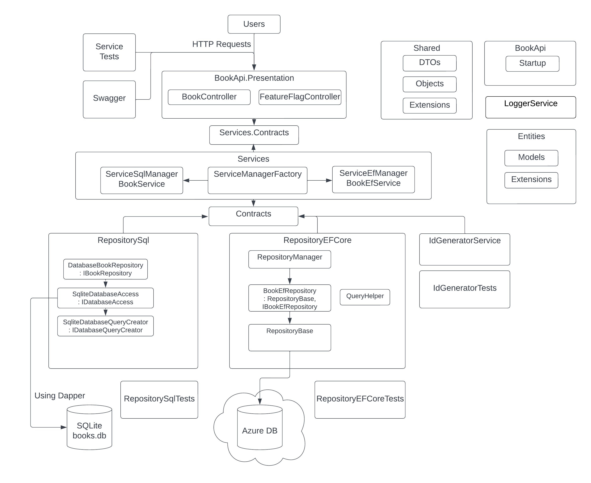

# BookManager API

Ett API skrivet i C# för böcker med en SQLite databas skapat med Test Driven Development (TDD).
Uppbyggt i tre lager: presentation, service och repository.

- Service test som täcker CRUD
- Unit test
- Github Projects använt vid utvecklingen
- Full beskrivning av processen (se nedan)
- Repository pattern, Options pattern
- Extension methods
- Global exception handling
- Dynamiskt byggda SQL queries med parametrar som skyddar mot SQL Injection
- Abstraktion för log service i separat LoggerService-projekt

## Run guide

Skapa connectionString för SQLite database.db-filen. Den finns i solution root under Database-mappen.
Exempel på databasens string finns i appsettings.json

Ingen setup ska behövas. 
Det enklaste är att öppna i Visual Studio och köra i debug för att komma åt Swagger.

Testerna kan köras via Test Explorer.

## Future development

Se Book Manager projektet i Github Projects.

## Saker jag inte gjort förut utan fått lära mig under byggandet
 
- Dapper för att hantera SQL connection
- Fluent Assertions för testerna
- Middleware för ASP.NET Core (global exception handling)
- Github Projects med Pull Request och kanban
- Testat att bygga en query creator (SqliteDatabaseQueryCreator). Kul, men jag hade nog använt Entity Framework Core från början om jag gjort det igen

## Lessons learned

- Mitt största misstag var att tänka att jag behövde namnge databasen på något speciellt sätt. Om jag hade hållit mig till ett DTO, data transfer object, och sen låtit databasens kolumner formas av mina interna datamodeller så hade jag sluppit mycket jobb.
- Att sätta upp service testen direkt var väl spenderad tid och TestDataHelper-klassen gjorde skapandet av testerna enkelt
- JsonFileBookRepository var onödigt: Jag visste att jag behövde en databas till slut, så även om det inte tog lång tid att skapa var det onödigt
- Jsonkonverteringen tog tid då jag inte var strikt när jag valde mellan NewtonSoft och den inbyggda JsonSerializern (skapade en extra JsonConverterare för DateOnly i onödan)
- Prioritera att koden fungerar via allmänt använda verktyg som Swagger och PostMan snarare än att få testen att fungera (skapade först workaround för testen istället för att hitta riktiga problemet)

# Processen

Processen beskrevs löpande, men redigerades i slutet för att att göra det mer lättläst (se develop-branchen för oredigerad version).
Jag skrev det här för att visa hur jag jobbade och tänkte när jag löste uppgiften.

Github Projects användes under utvecklingen:
https://github.com/users/gustaf-a/projects/1

## 1. Förstå problemet ordentligt  

Det första steget var att gå igenom uppgiften och förstå kraven.

- Skrev ner idéer löpande och börja skapa en informell backlog
- Försökte hitta eventuella dolda problem med kraven
- Läste på några minuter online om hur böckers information hanteras (Google Books API och goodreads.com)
- Försökte förstå vilka krav som kan komma att ändras ofta och vilka som kanske kommer ändras mindre ofta.

### Fel i testinstruktionerna?

- Instruktionerna verkar skrivit fel för POST och PUT. POST används i vanliga fall för att skapa och PUT för att uppdatera. Jag valde att gå med best practices och avvek från instruktionerna
- I use case för publish_date så skrivs det felaktigt som "published_date".

### Book-objektet  

Book-objektet kommer nog att förändras i framtiden. Det är viktigt att veta då det påverkar designen av programmet.
De här förändringarna känns viktigast:

- Add: Språk/language är viktigt 
- Add: Priset/price saknar valuta. Det är en farlig möjlig felfaktor för framtida användare av API:et
- Add: Type - böcker kan vara en ebok, pocket, ljudbok eller annat vilket kan vara viktigt
- Add: Publisher - publish_date finns, men det kan vara viktigt om en bok ges ut olika år av olika förlag i olika format
- Add: ISBN (International Standard Book Number) skulle kunna vara bra då det är internationell standard
- Change: En enda författare/author är problematiskt då många böcker har flera, men det borde gå att lösa med ; separator
- Change: En enda genre är problematiskt då många böcker har flera, samma lösning som för författare möjligt.

## 2. Definiera delar av programmet och försök hitta en MVP, Minimal Viable Product  

Nu med massor av idéer försökte jag den minsta möjliga produkten som fungerade. 
Det innebar att rita upp modeller på hög nivå och översätta kraven till design. Jag tänkte att programmet behövde:

- En controller med routes
- Databas eller lagring (i första versionen kan det vara .json-filen)
- Repository som hanterar databasen för att skapa och hämta böcker
- En service som lager mellan controllern och repot för att undvika att repot eller controllern får för många uppgifter
- Sortering av data (kan vara del av databasen)
- IdGenerator som skapar ID för nya böcker (kan vara del av databasen)
- Validering av data
- Unit tester
- Service tester
- Backlog med features att implementera senare
- Dokumentation av processen

## 3. Skapa grundläggande test-case

Use case-examplen i uppgiften var en perfekt startpunkt för testerna. 
Jag hade lagt tid på att skapa test-case om inte de funnits.

## 4. Skapa projekten och första röda service testerna 

- Skapade BookApi-projektet med en solution, sen xUnitprojekten BookApiServiceTests + BookApiUnitTests
- Testkörde BookApi för att säkerställa att det fungerade med OpenApi och Swagger för manuella tester
- Skapade en BookController och en Startup-fil i BookApi för att kunna köra service-test
- ServiceTests: Skapade BookController_should_getBooks med GetAllBooks_WhenBaseRouteCalled och såg till att det kunde köra.

## 5. Version control design

Jag valde att ha master, develop och sen feature-branches, ett förenklat Git Flow, för att:

- Visa hur jag är van vid att jobba från Sinch
- Versionskontroll känns viktigt med ett API. (en web app med kontinuerliga releaser kanske hellre vill använda GitHub Flow med bara master-branch)

Jag valde också att använda GitHub Projects för det kändes som ett bra tillfälle att lära mig det.
Jag är mer van vid JIRA, men det kändes kul att få lära mig GitHub Projects och viktigt att visa.

## 6. Första service testet kopplat till controllern: GetAllBooks_WhenBaseRouteCalled

- Skapade develop-branchen och en Issue i GitHub med ID BM1 (BookManager1), flyttade den till Github Projecs Book Manager/Doing
- Skapade en branch "bm1_base_url_returns_all_unsorted" från develop-branchen
- Arbetade utifrån servicetestet för att få alla böcker och hårdkodade först returvärden från controllern tills jag fick respons OK
- Skapade TestDataHelper-klassen för jag visste att jag skulle skapa många tester med
- Skapade JsonConverters för serializing och deserializing för service testen.

## 7. Grov implementering IBookService och IBookRepository

- Skapade IBookService, BookService, IBookRepository och JsonFileBookRepository, med samma json-konvertering som i ServiceTestet och första testet blev grönt
- Skapade en pull request från BM1-branchen till develop. Tog en paus från koden och kollade inte på Pull Requesten förrän dagen efter då jag kollade igenom och mergade.

## 8. Beslut kring databas, modellering och design

Först tänkte jag ta nästa use case och skriva test bara på det, men designen kändes nu beroende av hur jag skulle fortsätta hantera böckerna. 
Jag ville inte riskera att bygga vidare på JsonFileBookRepository och tvingas bygga egen sortering etc för att sen ändå i slutet byta till en riktig databas.

All data är välstrukturerad med förutsägbar struktur, så det finns ingen anledning till att NoSQL skulle passa för böckerna.
SQL har mycket av funktionaliteten som behövs inbyggd. Det känns som ett klassiskt databas-problem där SQL är lösningen.

## 9. BM2 - As a user of the API I can get books sorted by any field  

- Började med att skapade ett Theory service test med InlineData för att få datan sorterad på ID.

### SQLite 

- Skapade en SQLite databas med namnet books.db manuellt med programmet DB Browser. Skapade också books_seeding.sql för manuell återskapande av databasen
- Skapade IDatabaseAccess och SqliteDatabaseAccess för att komma åt databasen
- Skapade SqliteBookRepository och lade in det som default i projektet

### SQLite Queries

Sökte efter alternativ för hur jag skulle skicka kommandon till databasen och bestämde mig för att använda SQL queries som jag skapade i koden.
Jag ville inte använda Entity Framework för jag ville visa att jag kunde använda SQL direkt.

- Använde DB Browser for SQLite (ett användbart litet program för att öppna SQLite-databaser) för att testa SQL Queries
- Skapade IDatabaseQueryCreator och SqliteDatabaseQueryCreator som ger tillbaka ett Query-objekt med parametrar
- Utgick från unit test för att skapa logik i SqliteDatabaseQueryCreator för att sen testa att koppla upp mig till databasen
- Fick problem med dependencies till sqlite batteries, och en rekommenderad ominstallation av nuget fungerade inte. Jag installerade då Microsoft.Data.Sqlite istället för .Core (som har problem med en dependency, kanske pga jag började med en ASP.NET Core Web API template)
- Lade till logiken i query creator för select all queries för de olika fälten. Nu kunde jag manuellt få ut böcker från databasen via Swagger eller Postman

### Service tester för att få data sorterad på alla fält

- Använde en online JSON till CSV converter och använde ett spreadsheet för att skapa rätt sekvenser för testerna
- Skapade InlineData-drivna Theory tester som täckte att läsa data sorterad på alla fält
- Skapade Controller endpoints för de olika fälten då service testerna såklart visade NotFound 404 först
- Skapade en GitHub issue for att senare lägga till global exception handling för controller endpoints

PublishDate orsakade problem då C# namnkonventionen inte passar med SQLite namnkonventionen "publish_date"
- För att se till att inte behöva ändra C# objekt om jag vill byta databas i framtiden så skapade jag extra objektet BookSqlite och hanterade det i SqliteDatabaseQueryCreator

### Sorteringen av ID (B1, B10, B11 istället för B1, B2, B3)  

När mappningen mellan Book och BookSqlite var klar fungerade allting bra förutom sortering av ID-fältet (B1, B10, B11 istället för B1, B2, B3).

- Skapade en exempel SQL query för id och skapade separata unit test för ID-fältet och implementerade logiken
- Testerna gröna och service tester med! Sortering klar och alla tester grön! 

### Avslutade BM2  

- Skapade git commits och gjorde en pull request
- Åkte och tränade + var ute i solen för att få en paus
- Kolla på Pull Requesten och mergade.

## 11 BM5 - Get books filtered by text field values

- Servicetest för alla use case där böcker filtreras från text-värden
- Valde att börja med ett (inte ID) värde för att implementera enklast möjliga
- Skapade en controller endpoint
- Refactored till att använda StringBuilder och gradvis bygga SQL queries
- Skapade unit tester och när de var gröna och service testerna gröna skapade jag resten av controller endpointsen för text fält.

## 12 BM8 - Get books filtered by price

- Servicetest för use case med filtrering från price/pris
- Skapade två endpoints för price för att kunna använda double variabler för att använda inbyggd validering
- Unit test och implementerade logiken i query creator

## 13 BM11 - Get books filtered by date

- Servicetest för use case med filtrering från date/datum
- Arbetade lika som med BM8
- Städade upp i controllern genom att lägga till några extension methods

## 14 BM13 - Create new books through the API

- Servicetest som först skapade en bok och sen försökte hämta den via ID som kom tillbaka
- Skapade queryn i DB Browser och sen unit test query utifrån Book-objektet
- Skapade SqliteDatabaseIdGenerator och lade till det i DatabaseBookRepository innan det skickas till database access-klassen.

ID generering kan ske olika för olika typer av databaser, därför valde jag att göra det på bland de andra Sqlite-klasserna.

- Skapade unit tester för id generatorn
- Skapade SQL queryn manuellt för att få ut objektet med största nuvarande ID och sen unit tester för query creator
- Skapade ett nytt GetValueRequest-objekt för att hålla values separat från böckerna. Implementerade bara minsta möjliga för att få ut max ID

- Skapade Middleware för att ta emot requests som blev deserialized korrekt från JSON till Book-objekt då jag hade problem med Post och Put
- Lade till DELETE query för att köra testerna. Kämpade med lite för mycket saker på en gång, men det var kul.

## 15 BM16 - Update books

- Stort service test som först skapar nytt, sen uppdaterar ett fält och sen uppdaterar hela objektet, hämtar objektet och jämför och sen tar bort
- Unit tests för query och implementation
- Fixade tre små buggar som syntes nu med updates
- Snyggade till query creator med fler extension methods

## Release 1.0 färdigt

- Pull request från develop till master

## Efter Release 1.0

- Läser på om API best practices och börjar implementera förbättringar
- Mer kommentarer för att förenkla för den som är ny till koden.
- Förbättrad hantering av options
- Global exception handling
- Fler projekt för hantering av olika ansvarsområden, t.ex. repository, entities, contracts